# Website_Quan_Li_Bat_Dong_San
Website quản lí bất động sản
## Mô tả bài toán:
Hệ thống quản lý bất động sản khu vực vực thành phố Nha Trang giúp người dùng dễ dàng tìm kiếm và nắm bắt biến động của bất động sản.
## Phân công nhiệm vụ: 
Bắc (Model, View, Controller)
## Chức năng
  ### Người dùng
    * Xem thông tin bất động sản
    * Xem thông tin liên hệ chủ sở hữu
   ### Chủ sở hữu
    * Thêm, sửa, xóa, bất động sản
   ### Admin
    * Quản lí tài khoản
    * Quản lí bất động sản
    * Quản lí ảnh bất động sản
## Công nghệ sử dụng 
  * PHP
  * MySQL
  * Ajax
  * Font Awesome Icons
  * Datatables
  * HTML - CSS - JavaScript - JQuery
  * Bootstrap
## Thông tin liên hệ
  * Facebook: https://www.facebook.com/DinhDucBac.Puppy/
  * Gmail: dinhducbac1998@gmail.com
## Hướng dẫn cài đặt
### Cài đặt XAMPP
Trước tiên, ta vào trang web https://www.apachefriends.org/download.html chọn **Download (64 bit)** phiên bản mới nhất cho Windows (Ở đây là phiên bản **8.0.1**)

  

Sau khi tải xuống hoàn tất, ta chạy tệp vừa tải lên, sau đó nhấn nút **Next >** cho đến khi cài đặt hoàn tất.
### Cài đặt cơ sở dữ liệu
Ta chọn vào nút **Admin** của dịch vụ **MySQL** để vào được trang **phpMyAdmin**, sau đó nhấn vào tab **SQL** bên phải tab **Databases**.

  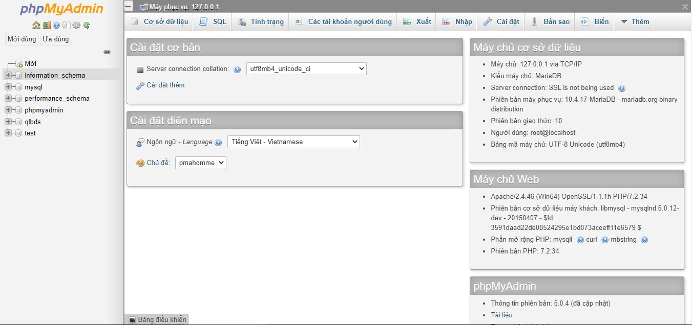

Lúc này, **XAMPP Control Panel** sẽ được bật lên. Ta sẽ chọn **Start** vào 2 dịch vụ quan trọng là **Apache** và **MySQL**.

  

Lúc này ta mở tệp **database.sql** bằng **Notepad**, ta **copy hết tất cả** và **patse** vào ô **SQL query** trong **phpMyAdmin**.

  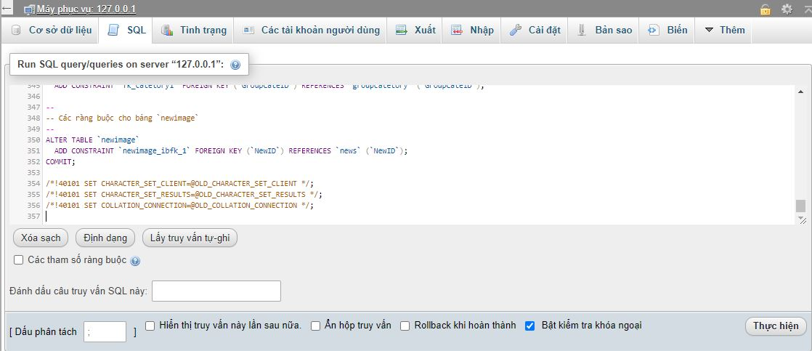

Sau khi copy patse hoàn tất, ta nhấn vào nút **Thực hiện** để thực thi các câu lệnh SQL. Sau khi thực thi hoàn tất, màn hình hiển thị **"# MySQL returned an empty result set (i.e. zero rows)"** là ta đã cài đặt cơ sở dữ liệu hoàn tất.
### Cài đặt code
Ta vào địa chỉ https://github.com/dinhducbac/Website_Quan_Li_Bat_Dong_San và nhấn nút **Code** > **Download ZIP**.

  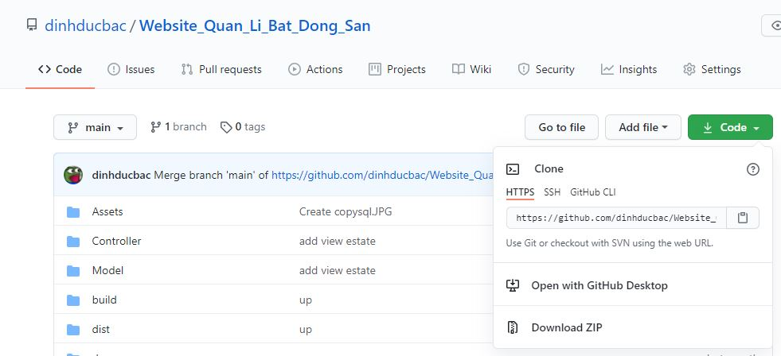

Sau khi quá trình tải xuống hoàn tất, giải nén tệp đã tải được thư mục **Website_Quan_Li_Bat_Dong_San-main**, sau đó sửa tên thư mục thành **Website_Quan_Li_Bat_Dong_San**. Cuối cùng, ta copy thư mục vào đường dẫn **"C:/xampp/htdocs"**.

  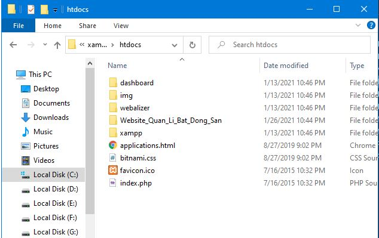

### Khởi chạy trang web
Ta vào địa chỉ http://localhost/Website_Quan_Li_Bat_Dong_San/index.php lúc này ta đã có thể sử dụng được trang web **Quản lý bất động sản Puppy**.
## Một số hình ảnh trang web

  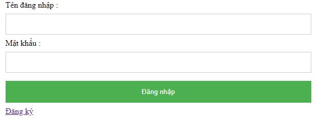
  <label><i>Trang "Đăng nhập"</i></label>

  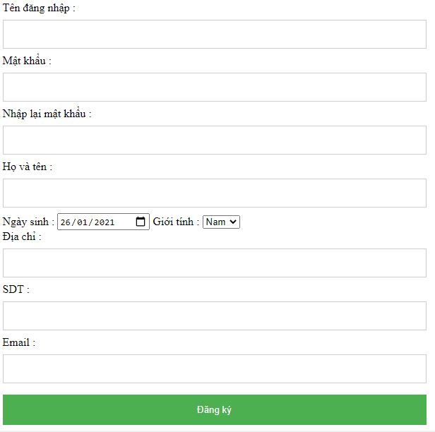
  <label><i>Trang "Đăng ký"</i></label>

  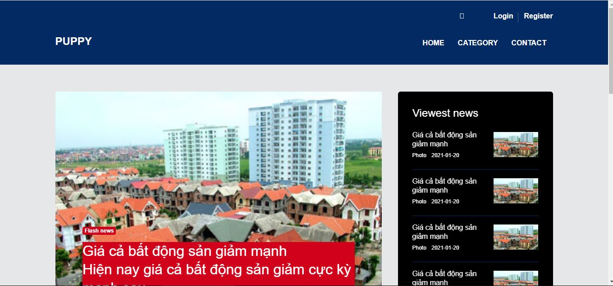
  <label><i>Trang chủ</i></label>

  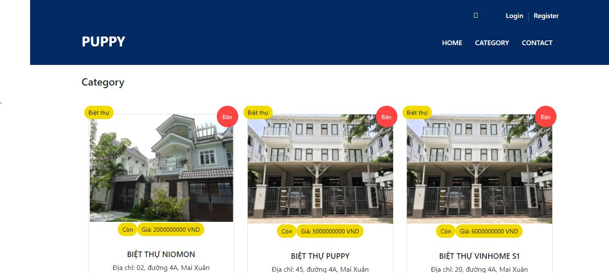
  <label><i>Trang sản phẩm</i></label>

  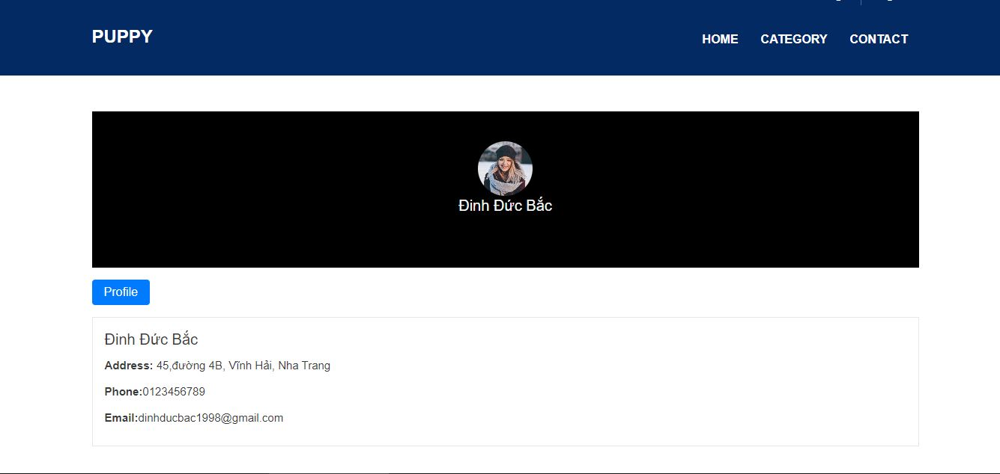
  <label><i>Trang liên hệ</i></label>

  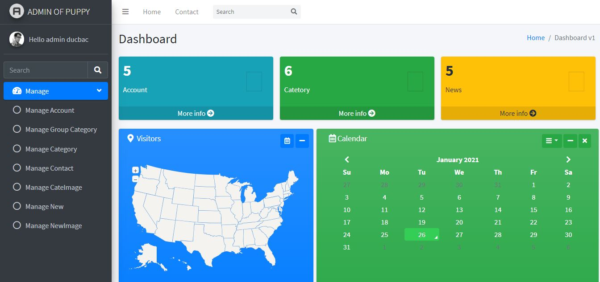
  <label><i>Trang admin</i></label>

  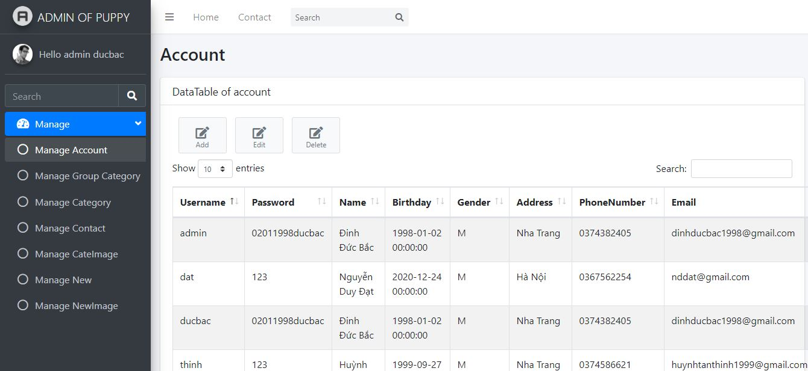
  <label><i>Trang "Quản lý tài khoản"</i></label>

  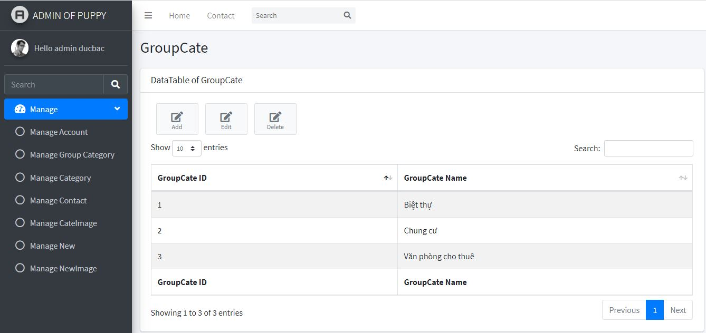
  <label><i>Trang "Quản lý nhóm bất động sản"</i></label>

  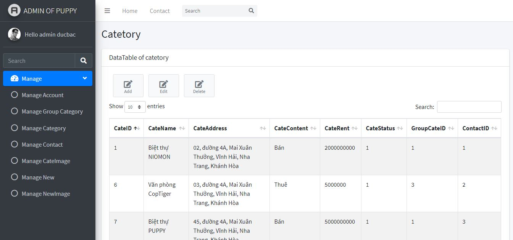
  <label><i>Trang "Quản lý bất động sản"</i></label>

  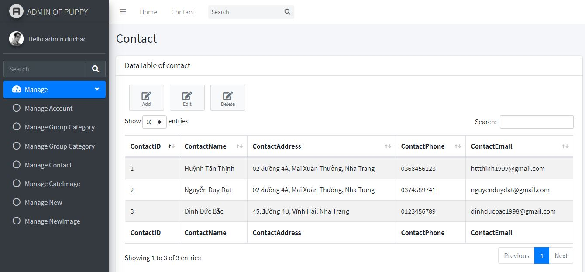
  <label><i>Trang "Quản lý liên hệ"</i></label>

  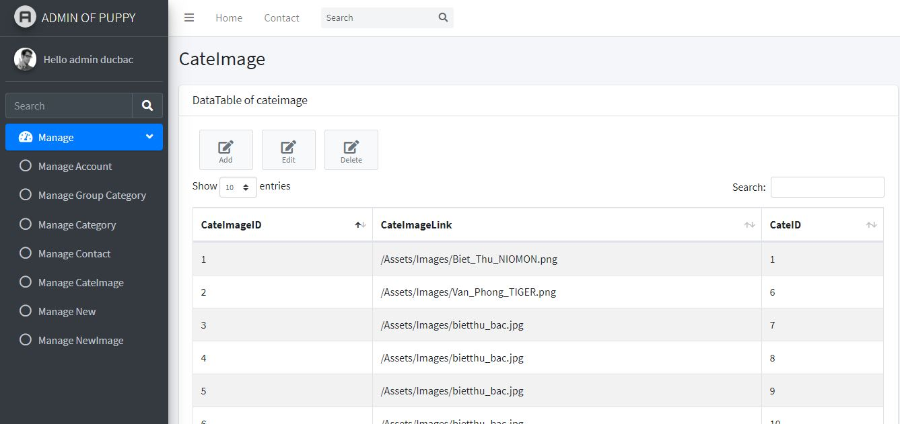
  <label><i>Trang "Quản lý ảnh bất động sản"</i></label>

  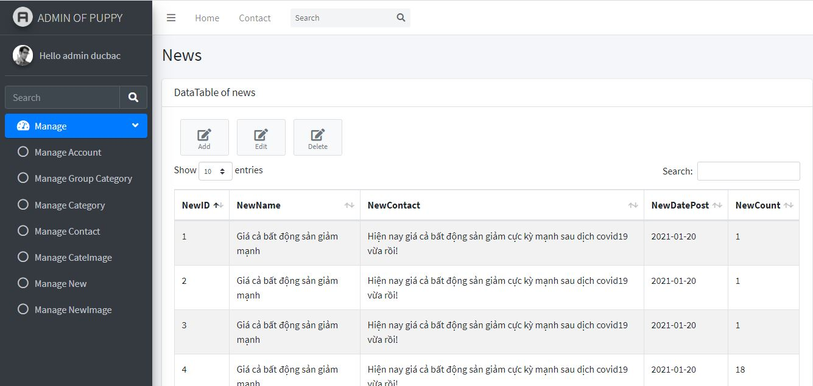
  <label><i>Trang "Quản lý tin tức"</i></label>

  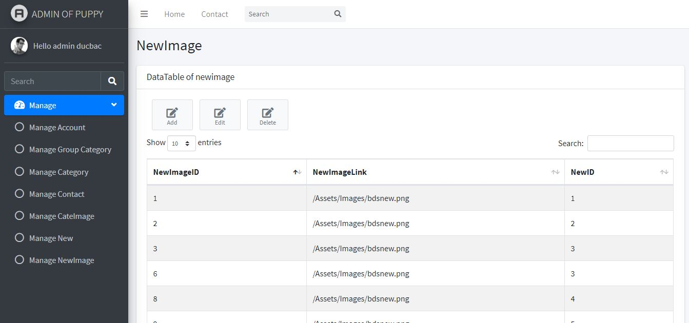
  <label><i>Trang "Quản lý ảnh tin tức"</i></label>

