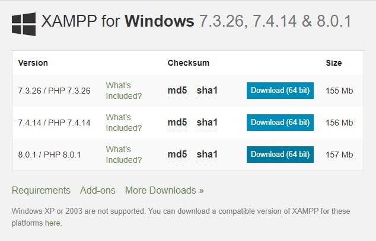
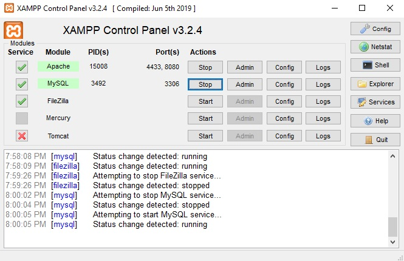

# Website_Quan_Li_Bat_Dong_San
Website quản lí bất động sản
## Mô tả bài toán:
Hệ thống quản lý bất động sản khu vực vực thành phố Nha Trang giúp người dùng dễ dàng tìm kiếm và nắm bắt biến động của bất động sản.
## Phân công nhiệm vụ: 
Bắc (Model, View, Controller)
## Chức năng
  ### Người dùng
    * Xem thông tin bất động sản
    * Xem thông tin liên hệ chủ sở hữu
   ### Chủ sở hữu
    * Thêm, sửa, xóa, bất động sản
   ### Admin
    * Quản lí tài khoản
    * Quản lí bất động sản
    * Quản lí ảnh bất động sản
## Công nghệ sử dụng 
  * PHP
  * MySQL
  * Ajax
  * Font Awesome Icons
  * Datatables
  * HTML - CSS - JavaScript - JQuery
  * Bootstrap
## Thông tin liên hệ
  * Facebook: https://www.facebook.com/DinhDucBac.Puppy/
  * Gmail: dinhducbac1998@gmail.com
## Hướng dẫn cài đặt
### Cài đặt XAMPP
Trước tiên, ta vào trang web https://www.apachefriends.org/download.html chọn **Download (64 bit)** phiên bản mới nhất cho Windows (Ở đây là phiên bản **8.0.1**)

  

Sau khi tải xuống hoàn tất, ta chạy tệp vừa tải lên, sau đó nhấn nút **Next >** cho đến khi cài đặt hoàn tất.
Lúc này, **XAMPP Control Panel** sẽ được bật lên. Ta sẽ chọn **Start** vào 2 dịch vụ quan trọng là **Apache** và **MySQL**.

  

